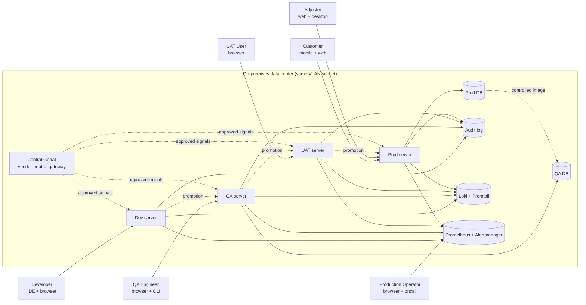

# System Context

> One-page orientation for anyone — human or agent — joining this project.
> If you can only read one architecture document, read this one.

## Mission

Process insurance claims end-to-end — First Notice of Loss (FNOL) through
final payout — for a Fortune 500 carrier, on on-premises physical servers,
with a central GenAI assistant that helps every step but never makes a
production decision without a human.

## What ships

A runnable system that has:

- One **product application** (the claims platform itself: API + web UI).
- One **platform layer** that the product runs on top of
  (CI/CD, GenAI gateway, DB image sync, audit log, observability, security).
- One **documented architecture trail** (this folder + `00_…docx`–`11_…docx`)
  proving every requirement is implemented and every decision is recorded.

## Container view (C4 Level 1)



## Primary flow

```
[Developer commits]
        │
        ▼
[Dev: build + unit tests + static analysis]
        │  (automated; developer approves their own change)
        ▼
[QA: Testcontainers integration + contract + manual QA pass]
        │  (automated + manual; QA engineer approves)
        ▼
[UAT: business validation by named UAT users]
        │  (manual; UAT lead approves)
        ▼
[Production: controlled release + post-deploy health checks]
        │  (DevOps operator approves; pipeline enforces)
        ▼
[Production: 24×7 monitoring + 24h log rotation]
        │  (operator oncall; GenAI RCA on request)
        ▼
[Feedback loop: GenAI summarises test failures, logs, anomalies]
```

See `promotion-pipeline.md` for the full state machine, gate definitions,
and the audit trail format.

## Non-negotiables (from the pack)

1. **Sequential promotion.** No Dev → Prod, no parallel fan-out.
2. **Human-in-the-loop for every release.** GenAI advises, humans approve.
3. **Two database instances only.** QA + Production. Replication is
   pipeline-mediated and one-directional (Prod → QA, sanitized).
4. **Same VLAN, logical separation.** Compensating controls are firewall
   rules, IP allow-lists, and host hardening.
5. **Central GenAI, vendor-neutral.** Implemented via LiteLLM gateway so
   the provider can change without touching application code.
6. **24×7 logging, 24h retention/reset.** Plus a separate issue-monitoring
   path. Logs and monitoring are not the same thing.
7. **No invented NFRs.** No invented performance targets, HA targets, or
   "enterprise" security controls beyond the confirmed baseline.

## Where to look next

| If you want to understand… | Read this |
|----------------------------|-----------|
| What we're using and why | [`tech-stack.md`](./tech-stack.md) |
| How the network is laid out | [`network-topology.md`](./network-topology.md) |
| How a release moves | [`promotion-pipeline.md`](./promotion-pipeline.md) |
| How we observe the system | [`observability-design.md`](./observability-design.md) |
| How security is enforced | [`security-baseline.md`](./security-baseline.md) |
| Why a specific decision was made | [`adr/INDEX.md`](./adr/INDEX.md) |
| What the agents are working on | [`multi-agent-plan.md`](./multi-agent-plan.md) |
| The actual claims business | [`../domain/claims-overview.md`](../domain/claims-overview.md) |
