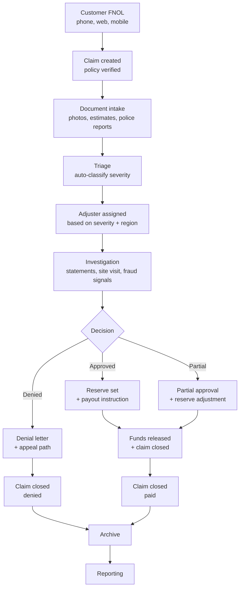

# Claims Domain — Overview

> What we are actually building. Read this before you touch
> `apps/claims-api/` or `apps/claims-web/`.

## What this is

A real-world insurance claims processing system. The kind a Fortune
500 carrier runs to handle hundreds of thousands of claims per year
across personal lines, commercial lines, and specialty products.

For the MVP, we focus on **first-party property & casualty** claims:
the customer reports a loss, an adjuster investigates, a decision
is made, money (or a repair) is delivered.

## The end-to-end flow



## Workflows in scope (MVP)

| # | Workflow | Owner role | Approvers | GenAI touchpoints |
|---|----------|------------|-----------|-------------------|
| 1 | FNOL intake | Customer Service Rep (CSR) | n/a (intake) | Form assist, policy lookup, duplicate detection |
| 2 | Document intake | CSR, Adjuster | n/a | OCR, classification, PII detection |
| 3 | Triage | System | Auto + Adjuster on borderline | Severity suggestion, fraud scoring |
| 4 | Investigation | Adjuster | Senior Adjuster for >$25k | Statement summarisation, evidence clustering |
| 5 | Adjudication | Adjuster | Senior Adjuster / UAT lead for high-value | Decision rationale assist, similar-claim lookup |
| 6 | Reserve management | Adjuster | Senior Adjuster for changes >$10k | Reserve recommendation |
| 7 | Payout | Finance Operator | n/a (auto on approval) | Reconciliation check, anomaly flag |
| 8 | Reporting | Operations | n/a | Narrative summaries, trend detection |

## Operating roles

- **Customer** — initiates the claim.
- **CSR (Customer Service Rep)** — first-line intake.
- **Adjuster** — owns the claim from triage to decision.
- **Senior Adjuster** — approves high-value decisions, manages
  reserves.
- **Finance Operator** — runs the payout.
- **Operations** — runs reports, monitors SLAs.
- **UAT User** — validates business behaviour in UAT.
- **Auditor** — read-only access to audit log + claims history.

## State machine — claim level

```
NEW → TRIAGE → INVESTIGATING → DECISION_PENDING → APPROVED → RESERVED → PAYOUT_PENDING → PAID
                                            └→ DENIED
                                            └→ WITHDRAWN
PAID/DENIED/WITHDRAWN → CLOSED → ARCHIVED
```

Any state can transition to `REOPENED` within 90 days of `CLOSED`,
with appropriate approval (Senior Adjuster).

## Data classification (default)

| Field class | Examples | Default handling |
|-------------|----------|------------------|
| Public | Claim number, status, dates | Visible to all roles |
| Internal | Reserve amount, decision notes | Visible to claims roles + auditor |
| Confidential | Customer name, address, phone | Visible to claims roles only, masked in logs |
| PII — high | SSN, DOB, bank account, driver's license | Visible to claims roles only, never to GenAI, never in logs |
| Secret | Passwords, tokens, encryption keys | Never in the database in plain; vault-backed |

## SLAs (defaults, not NFRs)

- **FNOL → triage:** 4 business hours.
- **Triage → adjuster assigned:** 1 business day.
- **Investigation completion (low severity):** 5 business days.
- **Investigation completion (high severity):** 30 business days.
- **Decision communication:** 2 business days from decision.
- **Payout:** 3 business days from approval.

These are *operational* targets, not NFRs. The pack does not set
NFRs (`ADR-010`); these are policy defaults that the operations
team can adjust without an ADR.

## Compliance scope

- **SOC 2 Type II** — we operate a financial workflow; the
  controls are mapped in `docs/compliance/soc2.md` (TBD).
- **GDPR / CCPA** — right-to-erasure, data export, consent
  tracking. Mapped in `docs/compliance/privacy.md` (TBD).
- **NAIC** — state-by-state insurance regulations. Mapped in
  `docs/compliance/naic.md` (TBD).

Each of these gets its own compliance workstream in
`multi-agent-plan.md` once the foundation is past the MVP cut.

## Out of scope (MVP)

- Underwriting / policy issuance.
- Billing / premium collection.
- Reinsurance.
- Subrogation and recovery.
- Litigation tracking.
- Mobile adjuster app.
- Customer self-service beyond FNOL.

Each is a follow-up ADR when the time comes.
